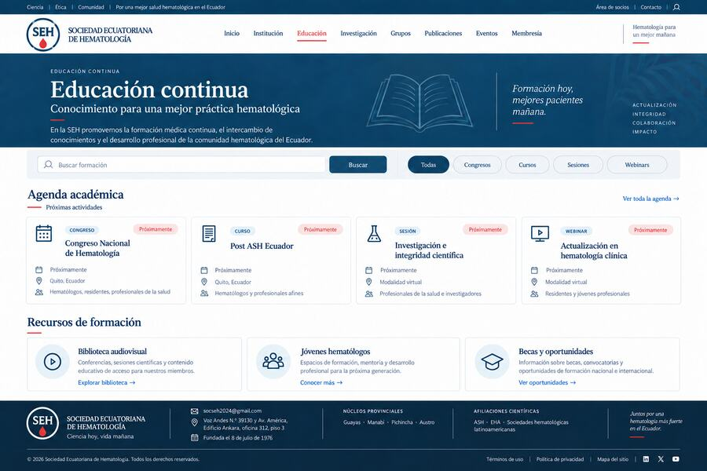
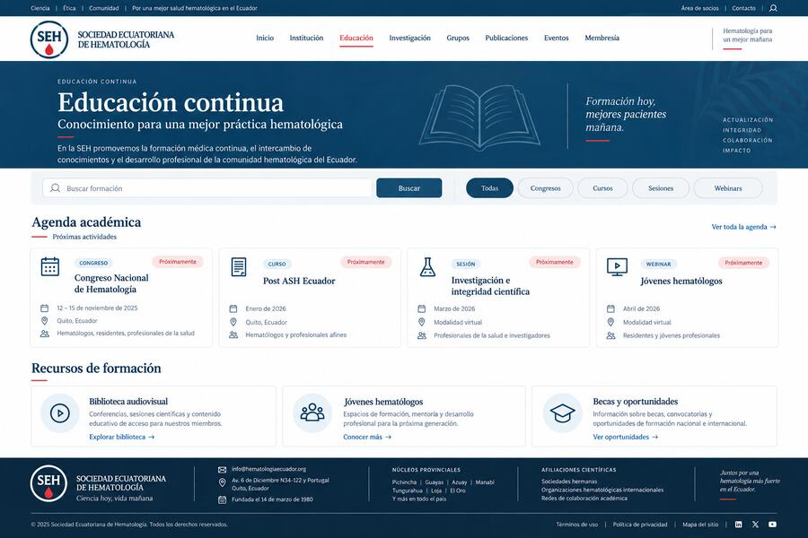

# Sociedad Ecuatoriana de Hematologia - Web SEH

Repositorio del portal institucional, cientifico y educativo de la Sociedad Ecuatoriana de Hematologia (SEH).

## Descripcion general

Esta version inicial contiene una propuesta funcional para un sitio moderno de sociedad cientifica nacional, con identidad visual sobria, predominio de azul petroleo, rojo hematologico limitado a acentos y contenidos separados por audiencia profesional, cientifica, institucional y comunitaria.

## Vista previa del sitio

Estas capturas muestran a los usuarios la propuesta visual del modulo de Educacion Continua dentro del portal SEH.

### Educacion Continua - maqueta corregida



### Portal de Educacion Continua



## Modulos incluidos

- Inicio institucional.
- Educacion continua.
- Agenda Nacional de Investigacion Hematologica.
- Institucion.
- Investigacion.
- Grupos de Investigacion.
- Publicaciones.
- Eventos.
- Membresia.
- Pacientes y comunidad.
- Contacto institucional.

## Rutas principales

| Ruta | Contenido |
|---|---|
| `/` | Portada institucional |
| `/educacion` | Modulo de Educacion Continua |
| `/agenda-nacional` | Agenda Nacional de Investigacion Hematologica |
| `/institucion` | Informacion institucional |
| `/investigacion` | Ecosistema de investigacion |
| `/grupos` | Grupos de Investigacion |
| `/publicaciones` | Publicaciones y documentos cientificos |
| `/eventos` | Agenda cientifica |
| `/membresia` | Afiliacion y acceso de socios |
| `/pacientes` | Pacientes y comunidad |
| `/contacto` | Contacto institucional |

## Tecnologia

- Next.js 16.
- React 19.
- TypeScript.
- CSS propio.
- Export estatico de Next.js servido por Nginx sin privilegios.
- Dockerfile listo para Dokploy.
- Puerto interno de produccion: `8080`.

## Desarrollo local

```bash
npm install
npm run dev
```

La aplicacion local inicia en `http://localhost:3000`.

Construccion de produccion:

```bash
npm run build
npm run start
```

El contenedor de produccion sirve la carpeta `out/` con Nginx. No ejecuta un
servidor Node.js en runtime.

## Despliegue en Dokploy

1. Entrar a Dokploy.
2. Crear un proyecto para SEH o reutilizar el proyecto definido por el propietario.
3. Crear una nueva aplicacion.
4. Seleccionar GitHub como proveedor.
5. Conectar este repositorio: `oncoorch/webtest_seh`.
6. Usar la rama `production`.
7. Seleccionar despliegue con `Dockerfile`.
8. Configurar puerto interno `8080`.
9. Configurar variables sensibles solo desde Dokploy. No subir archivos `.env`.
10. Ejecutar deploy.
11. Verificar `/`, `/educacion`, `/agenda-nacional`, `/investigacion`, `/membresia` y `/contacto`.
12. Agregar el dominio confirmado por el propietario: `test-seh.oncoorch.com`.
13. Aplicar en Cloudflare un registro `A` hacia la IP publica del VPS NICOP.
14. Activar proxy de Cloudflare solo despues de validar el origen y HTTPS.
15. Habilitar HTTPS y verificar certificado TLS.

## DNS y reversion

Antes de cambiar DNS, documentar el valor anterior. Si el nuevo despliegue falla, revertir DNS al valor previo y mantener el ultimo contenedor saludable.

Registro esperado para publicacion:

| Tipo | Nombre | Destino | Proxy |
|---|---|---|---|
| `A` | `test-seh` | IP publica del VPS NICOP | Proxied despues de validar origen |

## Versionamiento

Version actual: `v1.0.1`.

- `MAJOR`: redisenos estructurales o cambios incompatibles.
- `MINOR`: nuevos modulos o funcionalidades.
- `PATCH`: correcciones visuales, de contenido o accesibilidad.

## Seguridad

- No subir tokens, secretos OAuth, credenciales ni archivos `.env`.
- No publicar datos clinicos ni informacion personal identificable.
- Revisar contenidos cientificos antes de publicacion definitiva.
- Servir produccion como sitio estatico en Nginx sin privilegios.
- No conectar esta aplicacion a redes internas de bases de datos, CRM, n8n ni otros servicios.
